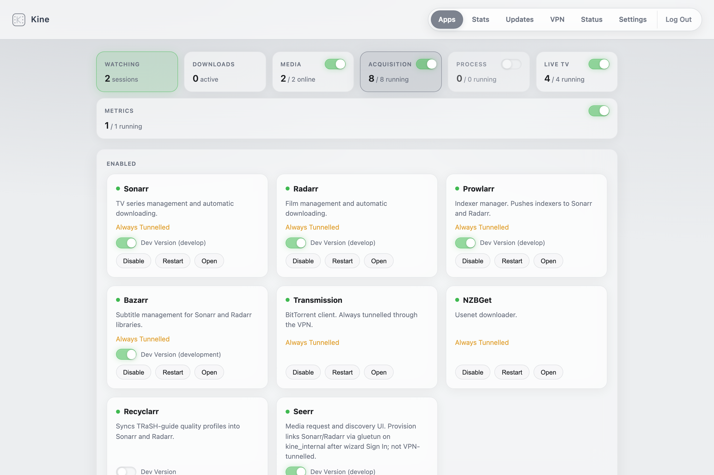
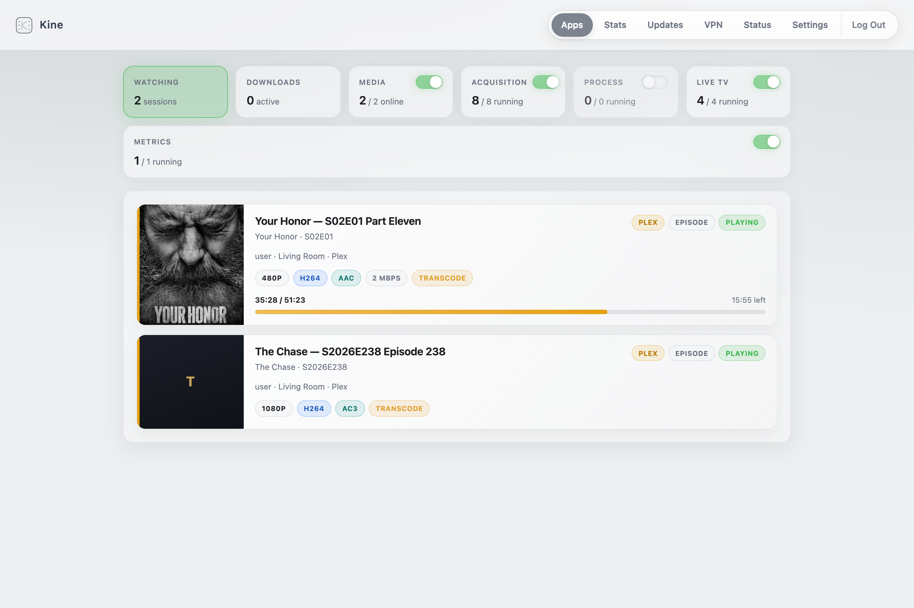
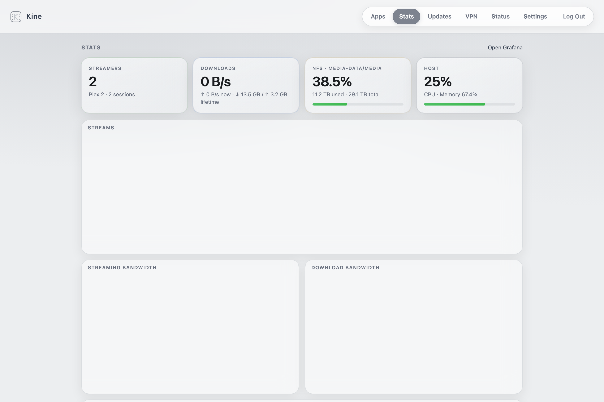
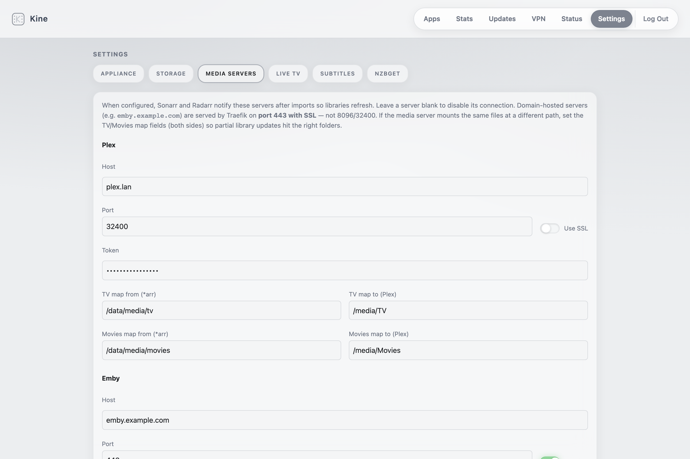

# Kine

Kine is a self-hosted media appliance on Docker Compose: acquisition (*arr),
VPN-routed downloads, optional Emby and Live TV, optional Pi-hole, and
metrics. Traefik is the HTTPS entry point. A provisioner wires a fresh
install so the apps come up mostly pre-configured.

**Helm** is the operator UI. The Dashboard enables apps and shows who is
streaming, what is downloading, and whether Sonarr and Radarr still have
missing items. Stats, VPN, and Settings are the other tabs. Updates sit in
the footer.

<p align="center">
  
</p>

## What you get

- **Provisioned stack** — root folders, download clients, Prowlarr→*arr, and
  optional Emby wizard / Seerr / Bazarr wiring without hand-editing each app
- **VPN kill switch** — acquisition shares gluetun’s WireGuard namespace.
  Live TV starts there and can move to Direct as a group. No tunnel means
  no outbound path for anything still inside it
- **Pi-hole** — optional DNS for the LAN and for apps outside the tunnel.
  Its only general upstream is the primary VPN
- **Helm admin** — Dashboard, Stats, VPN, and Settings over the same Compose
  profiles the CLI uses
- **Traefik HTTPS** — subdomain routing, mDNS on the LAN, optional Let’s Encrypt
  DNS-01 (ClouDNS)
- **Remote library notify** — Plex/Emby connections with path maps when mounts
  differ from `/data/media/...`

## Screenshots

| Apps | Watching |
|:----:|:--------:|
|  |  |

| Stats | Settings — Media Servers |
|:-----:|:------------------------:|
|  |  |

## Production requirements

- Linux x86_64 with Bash, Python 3, PyYAML, OpenSSL, and standard GNU tools
- Docker Engine and Docker Compose **2.20+** (`include:` is required)
- Free TCP ports for Traefik (defaults **8080** / **8443**; `install.sh`
  picks the next free ports when those are taken)
- `/dev/net/tun` for gluetun
- One filesystem at `DATA_ROOT` for both media and downloads (hardlinks /
  atomic imports)
- Enough free disk for app state and images (preflight warns below 20 GB on `/`)
- Optional `/dev/dri/renderD128` for Intel QuickSync

For host-managed NFS: NFS client packages, `util-linux` (`mountpoint` /
`findmnt`), and a systemd-compatible `/etc/fstab`.

Kine is for a trusted LAN. Do not expose Helm or the Docker socket proxy to
the internet.

## Linux installation

```bash
git clone <repository-url> kine
cd kine
sudo install -d /srv/kine/config/{ecm,teamarr,unpackerr}
sudo touch /srv/kine/config/{ecm/ecm.env,teamarr/teamarr.env,unpackerr/unpackerr.env}
sudo ./install.sh
```

The empty `env_file`s are required because Compose validates them before the
provisioner can populate them.

The installer is idempotent. On first run it:

1. Creates `.env` from `.env.example` (or merges missing keys), generates
   secrets, and picks free Traefik ports when needed
2. Checks Compose, storage, TUN, and optional GPU support
3. Creates the `kine` service user and data/config directories
4. Prepares TLS, seeds app config, starts enabled profiles, and runs provision

Typical URLs after install:

- Admin: `https://kine-admin.kine.local:8443` (or `:443` if set in `.env`)
- Emby: `https://emby.kine.local:8443`
- Helm recovery: `http://<host-lan-ip>:8600`

First-run admin password must be at least 12 characters. If VPN is enabled in
onboarding, paste a valid WireGuard client config.

**Live TV:** enable the Live TV section → finish Dispatcharr’s first login →
create an API token → paste it under Helm → Settings → Live TV. Helm registers
Dispatcharr as Emby’s HDHomeRun tuner and writes the token into ECM/Teamarr.

**TLS:** `internal` uses Traefik’s self-signed cert (browsers warn). `custom`
reads `fullchain.pem` / `privkey.pem` from `${STACK_ROOT}/config/traefik/certs/`.
`acme-dns` issues a Let’s Encrypt wildcard for `*.${KINE_DOMAIN}` via DNS-01
(default: ClouDNS) — set `KINE_ACME_EMAIL` and credentials under Settings →
Appliance, then Save. No inbound 80/443 required for renewal.

## Application defaults

Fresh installs leave every visible app section disabled. Core platform services
and mDNS start immediately; onboarding may start Gluetun when VPN is selected.

Enabling a section selects its catalogue defaults:

| Section | Defaults |
|---------|----------|
| Media | none (enable Emby individually) |
| Acquisition | Sonarr, Radarr, Prowlarr, Transmission, Recyclarr |
| Process | Tdarr |
| Live TV | Dispatcharr, ECM, Teamarr, Game Thumbs |
| Metrics | Grafana (+ Prometheus, cAdvisor, node-exporter) |
| Network | none (enable Pi-hole individually) |

Optional individually: Emby, Lidarr, Beets, Jackett, Bazarr, NZBGet,
Unpackerr, Seerr, ECM MCP, Pi-hole.
Prowlarr is the indexer proxy wired into Sonarr/Radarr. Recyclarr syncs TRaSH
Guide 1080p profiles (`WEB-1080p` / `HD Bluray + WEB`) on a daily cron.

Seerr is not tunnelled. After its wizard Sign In, provision registers Sonarr and
Radarr at `gluetun:8989` / `gluetun:7878`. See the Seerr docs in-app if the
wizard still asks for Configure Services.

Pi-hole is its own container, beside the tunnel. Point the router or each
LAN device at the Kine host for DNS. The web UI is
`https://pihole.${KINE_DOMAIN}` on the Traefik HTTPS port. The password is
`PIHOLE_WEBPASSWORD` in `.env`. Install replaces an empty value or
`change-me` with a random one and leaves a password you already set.

Upstream queries leave only through the primary WireGuard tunnel
(`KINE_DNS_GLUETUN`, default `172.16.53.2`). External DNS stops while that
tunnel is down. Enabling Pi-hole recreates the tunnel group so Gluetun can
join the DNS bridge, and recreates the apps that should use Pi-hole:
Traefik, Helm, the provisioner, Emby, Tdarr, Beets, Seerr, Recyclarr, Game
Thumbs, and the metrics containers. Apps that share a tunnel keep that
tunnel's resolver.

The DNS bridge is `172.16.53.0/27`. Docker keeps `.1` as the gateway.
Gluetun is `.2` and Pi-hole is `.3`. Other containers are addressed from
`172.16.53.16/28`, so a later start cannot take those two addresses. If the
subnet overlaps another Docker network, change `KINE_DNS_SUBNET`,
`KINE_DNS_POOL`, `KINE_DNS_GLUETUN`, and `KINE_DNS_PIHOLE` together.
`FIREWALL_OUTBOUND_SUBNETS` has to contain the subnet. The default list
already does, via `172.16.0.0/12`.

Port 53 is published on every address in `KINE_DNS_BIND`. An empty value
means every interface, which fails when anything on the host already holds
port 53. Enable then publishes Pi-hole on the host's other addresses and
records them in `KINE_DNS_BIND`. A listener on every interface still stops
enable. An address added later, such as a VRRP address, is not answered
until it is listed there and Pi-hole is recreated while the address exists
on the host.

Names your router already serves are not in Pi-hole until you add them.
Set the local domain and a conditional forwarder in the Pi-hole UI (a
`revServer` for that domain, aimed at the router). Otherwise Helm cannot
resolve a remote Emby or Plex hostname and shows that server offline. Leave
the general upstream on Gluetun. A public resolver there bypasses the VPN.

**Metrics** (off by default) records stack history. Helm’s **Stats** page embeds
overview panels; app cards get CPU sparklines when Prometheus is up. Grafana is
readable without login so embeds work; `GRAFANA_ADMIN_PASSWORD` is only for
editing dashboards.

Tdarr is in **Process** (not tunnelled). Libraries under `/media/...`; cache at
`${DATA_ROOT}/cache/tdarr` or `NFS_CACHE` after `sudo ./scripts/mount-media.sh`.

Important defaults:

| Setting | Default |
|---------|---------|
| Domain | `kine.local` |
| Timezone | `Europe/London` |
| Stack state | `/srv/kine` |
| Media/downloads | `/srv/media-data` |
| Helm bind | `0.0.0.0:8600` |
| Admin user | `admin` / `kine-admin` (from install) |
| VPN | ProtonVPN WireGuard + port forwarding |
| TLS | `internal` |

Layout under `DATA_ROOT`:

```text
/srv/media-data/
├── media/{movies,tv,sports,recordings}/
└── downloads/{incomplete,complete}/
```

Sonarr uses `/data/media/tv`, Radarr `/data/media/movies`, downloads
`/data/downloads/complete`. Emby mounts media read-only.

## Docker Desktop on macOS

macOS is for development/testing, not production. Docker Desktop provides
`/dev/net/tun` but not Intel `/dev/dri` (Emby software-transcodes).

```bash
cp .env.example .env
mkdir -p .local/stack/config/{ecm,teamarr,unpackerr} .local/data
touch .local/stack/config/{ecm/ecm.env,teamarr/teamarr.env,unpackerr/unpackerr.env}
```

Edit `.env`: absolute `STACK_ROOT` / `DATA_ROOT` under this checkout; numeric
`PUID`/`PGID`; fresh `KINE_SECRET` and `HELM_SESSION_SECRET`;
`COMPOSE_FILE=docker-compose.yml:.local/compose.macos.yml`; empty `NFS_*`;
WireGuard config or drop gluetun and acquisition profiles for UI-only tests.

```bash
./scripts/tls-setup.sh
docker compose build provision helm
./kine seed
docker compose pull --ignore-buildable
./kine up
./kine provision
```

Use `http://localhost:8600` for Helm. App launch buttons use
`<app>.127.0.0.1.nip.io` through Traefik. See [.local/compose.macos.yml](.local/compose.macos.yml)
for the Emby GPU override.

## NFS storage

NFS is mounted by the **Linux host**, not by containers. In **Settings →
Storage**, set the NFS server and Browse exports (UniFi `/.data` shares show
friendly names). On Docker Desktop, run `sudo ./kine nfs-agent` so Browse can
list subfolders from the VM.

```dotenv
NFS_SERVER=192.168.1.10
NFS_MEDIA=/exports/media
NFS_DOWNLOADS=/exports/media/downloads
NFS_CACHE=/exports/cache
```

Leave `NFS_TV` / `NFS_MOVIES` empty when they already live under `NFS_MEDIA`.
Leave `NFS_CACHE` empty for a local Tdarr cache.

```bash
sudo ./scripts/mount-media.sh
```

That manages a `# BEGIN kine-nfs` `/etc/fstab` block. For hardlinks, keep
downloads under the same media export (see script comments and
[docs/troubleshooting.md](docs/troubleshooting.md)). Helm only saves values;
run `mount-media.sh` on the host after changes.

## VPN and TUN behavior

Helm stores WireGuard profiles in `config/helm/vpn-profiles.json`. The first
VPN tab visit imports an existing `wg0.conf` as **Default** when needed.
Exactly one profile is **Primary** at a time; others can run as secondary
tunnels with a checklist of forced-tunnel apps. Unassigned apps stay on the
primary tunnel. Saving assignments regenerates
`docker-compose.override.yml` (gitignored; same text as
`compose/vpn-routing.generated.yml`), which adds secondary `gluetun-<shortId>`
containers and moves each app to `network_mode: service:<tunnel>` (kill switch
unchanged). Multiple
profiles can run concurrently with different egress IPs.

Most of acquisition and Live TV use `network_mode: service:gluetun` by
default; the override moves apps to their assigned tunnel. Seerr stays on
`kine_internal` and reaches *arr at the tunnel that owns each app. Emby
stays untunnelled and reaches Dispatcharr HDHomeRun on that app's tunnel
host.

**Direct Live TV.** On the VPN tab, move the Live TV group to Direct.
Dispatcharr, ECM, ECM MCP, and Teamarr then leave the tunnel and use their
own containers. They reach each other by service name (`dispatcharr:9191`,
`ecm:6100`, `teamarr:9195`). While they share a tunnel they use
`127.0.0.1` and those same ports. Helm rewrites the peer URLs when the
group moves. Game Thumbs stays untunnelled either way. Assigning any of
those four apps to a VPN profile turns Direct off.

- No independent interface or fallback route for tunnelled apps
- Tunnel down ⇒ acquisition down, and Live TV down while it is still inside the tunnel
- Shared port space inside each tunnel — see [docs/port-map.md](docs/port-map.md)
- Restart with `./kine vpn restart`, not `./kine restart gluetun`

```bash
./kine vpn status
./kine vpn leaktest
```

`COMPOSE_PROFILES` decides what runs; onboarding/API keep `VPN_ENABLED` in sync.

## Architecture

**Compose profiles** in `.env` select fragments under `compose/`. Catalogue
`requires` must mirror Compose `depends_on` (enforced by tests).

**Image channels:** optional `dev_tag` + `APP_DEV_CHANNELS` switches an app to
its develop pin while remembering `<APP>_STABLE_TAG`.

**Provisioning:** `KINE_SECRET` derives API keys before first boot; the seeder
never overwrites an existing key; `./kine provision` is idempotent.

**Single `/data` mount** from `DATA_ROOT` keeps hardlinks/atomic moves.

**Traefik** terminates HTTPS by subdomain; `mdns` advertises `.local` names.

**Helm** edits `.env` and drives Docker via `tecnativa/docker-socket-proxy`:

| Tab | Role |
|-----|------|
| Dashboard | Sections and apps, Watching, Downloads, Missing Search, dev channels |
| Stats | Embedded Grafana / stack metrics |
| VPN | Profiles, Direct Live TV, status, restart tunnel group |
| Settings | Domain, TLS, NFS, Plex/Emby notify + path maps, Live TV token, OpenSubtitles |

Updates are the footer chip: per-app and Update All. Disabled apps are
skipped. Updating gluetun recreates its tunnel peers.

Provision (`seed` / `wire`) is single-flight via `${STACK_ROOT}/provision.lock`.

```text
compose/        Compose fragment per service
provision/      Seeding and API wiring recipes
helm/           FastAPI admin + single-file frontend
mdns/           Avahi host generation
scripts/        Preflight, TLS, storage, backup, updates, VPN
tests/          Structural and backend invariants
catalogue.yml   Shared app metadata and dependencies
docs/images/    README screenshots
```

Runtime state: `STACK_ROOT`. Media/downloads: `DATA_ROOT`. Backups cover `.env`,
Compose/catalogue, and app config — never media libraries.

## Common commands

```bash
./kine apps                 # catalogue + enabled
./kine ps                   # running services
./kine up / ./kine down
./kine logs sonarr
./kine enable bazarr        # profile + start + provision
./kine disable bazarr
./kine provision            # idempotent wiring
./kine updates              # digest check
./kine update sonarr        # backup, pull, recreate, health-check
./kine vpn restart
./kine tls
./kine backup
./kine restore <archive>
```

`./kine rekey` rotates every derived internal API key (breaks external clients
holding old keys). See [docs/troubleshooting.md](docs/troubleshooting.md).

## Testing

```bash
python3 -m venv .venv
. .venv/bin/activate
python -m pip install pytest pyyaml httpx
python -m pytest tests -q
```

After `.env` exists:

```bash
docker compose config --quiet
for script in install.sh kine scripts/*.sh; do bash -n "$script"; done
```

On macOS set `COMPOSE_FILE=docker-compose.yml:.local/compose.macos.yml` before
the Compose check. Tests cover profile/catalogue drift, VPN namespace
invariants, ports, mounts, provisioner behavior, and Helm access.

## License

MIT. See [LICENSE](LICENSE).
